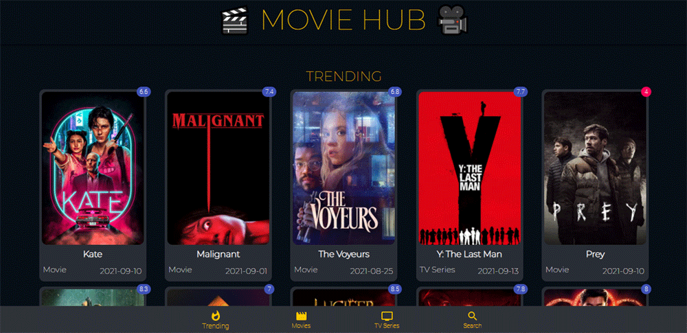

# Movie Hub
## Features:
* A Single Page Application(SPA) with a dynamic list of movie data loaded from the REST API
* Shows trending movies on the homepage where pagination is available
* The 'Movies' and 'TV Series' routes will show all the list of movies and the TV series
* Users can filter movies or TV series by genres
* On the 'Search' route, a user can search for a movie or TV series with a name
* Clicking on a single movie or TV series will show movie details with a movie trailer link
* This is a fully responsive website using the Material UI.

## Technology Used: 
* React.js
* REST API
* React Router
* React alice carousel
* Material UI
* Netlify(Hosting)

## Project preview:

## 🔗 Live Site Link:
https://movie-hub-2021.netlify.app/